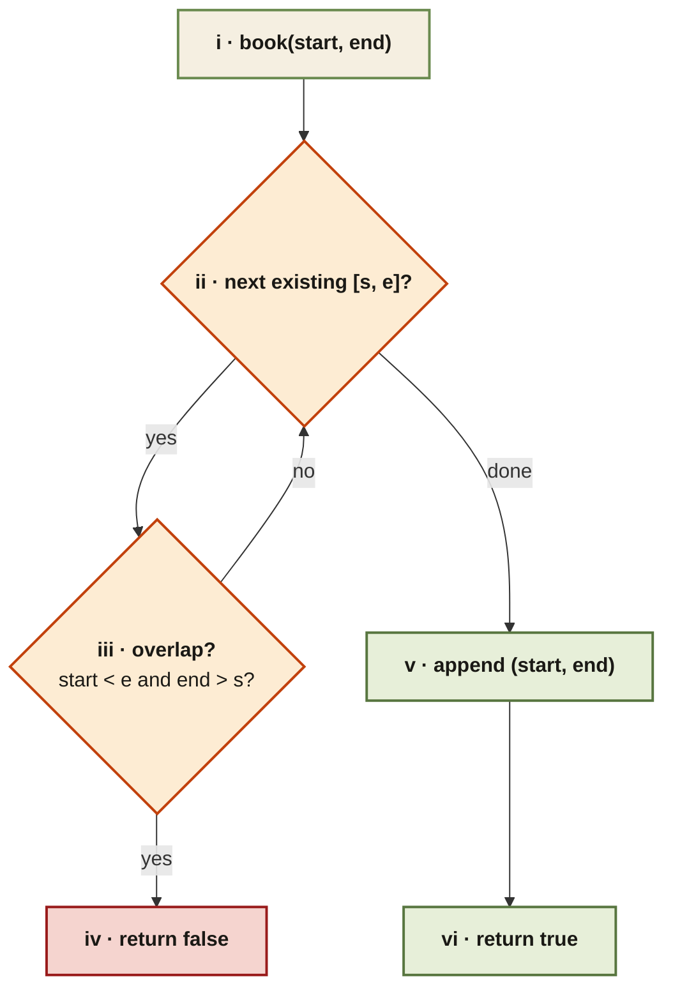

<Callout type="insight" title="Per-call overlap scan">
  Each `book(start, end)` call scans existing bookings; the first overlap
  rejects the booking, otherwise it gets appended. Half-open intervals
  mean the overlap condition uses strict `<`/`>`.
</Callout>

## My Calendar I — control flow

<FlowLegendGrid items={[
  { numeral: 'i',   name: 'Entry',          description: 'New booking arrives as `(start, end)` — half-open interval.' },
  { numeral: 'ii',  name: 'Iterate',        description: 'Walk existing bookings one at a time.' },
  { numeral: 'iii', name: 'Overlap test',   description: '`start < e and end > s` — strict because `[start, end)` is half-open.' },
  { numeral: 'iv',  name: 'Reject',         description: 'First overlap ends the scan; return `false` without mutating state.' },
  { numeral: 'v',   name: 'Accept',         description: 'No overlaps found — append `(start, end)` to the bookings list.' },
  { numeral: 'vi',  name: 'Return',         description: 'Signal success with `true`.' },
]} />
