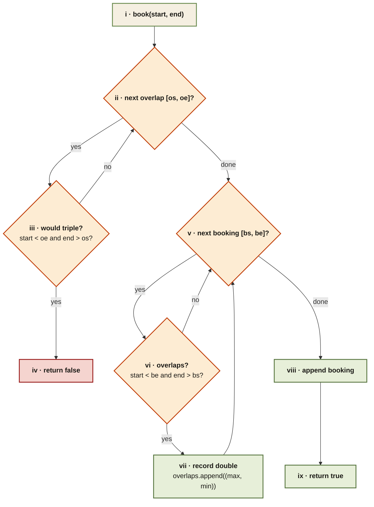

<Callout type="insight" title="Two scans per call">
  Check against the `overlaps` list first — any overlap there means a
  triple booking, so reject. Otherwise, walk `bookings` and record each
  intersection into `overlaps`, then append the new event.
</Callout>

## My Calendar II — control flow

<FlowLegendGrid items={[
  { numeral: 'i',    name: 'Entry',               description: 'New booking `(start, end)`.' },
  { numeral: 'ii',   name: 'Iterate overlaps',    description: 'Loop the list of existing double-booked regions.' },
  { numeral: 'iii',  name: 'Triple-booking test', description: '`start < oe and end > os` — overlap with a double-booking would mean three active events.' },
  { numeral: 'iv',   name: 'Reject',              description: 'Return `false` without mutating any state.' },
  { numeral: 'v',    name: 'Iterate bookings',    description: 'If we didn’t reject, walk the full bookings list.' },
  { numeral: 'vi',   name: 'Overlaps existing?',  description: 'Standard half-open overlap check.' },
  { numeral: 'vii',  name: 'Record',              description: 'Append `(max(start, bs), min(end, be))` — the newly-created double-booking region.' },
  { numeral: 'viii', name: 'Append booking',      description: 'Only now do we actually accept the event.' },
  { numeral: 'ix',   name: 'Return',              description: 'Signal success with `true`.' },
]} />
