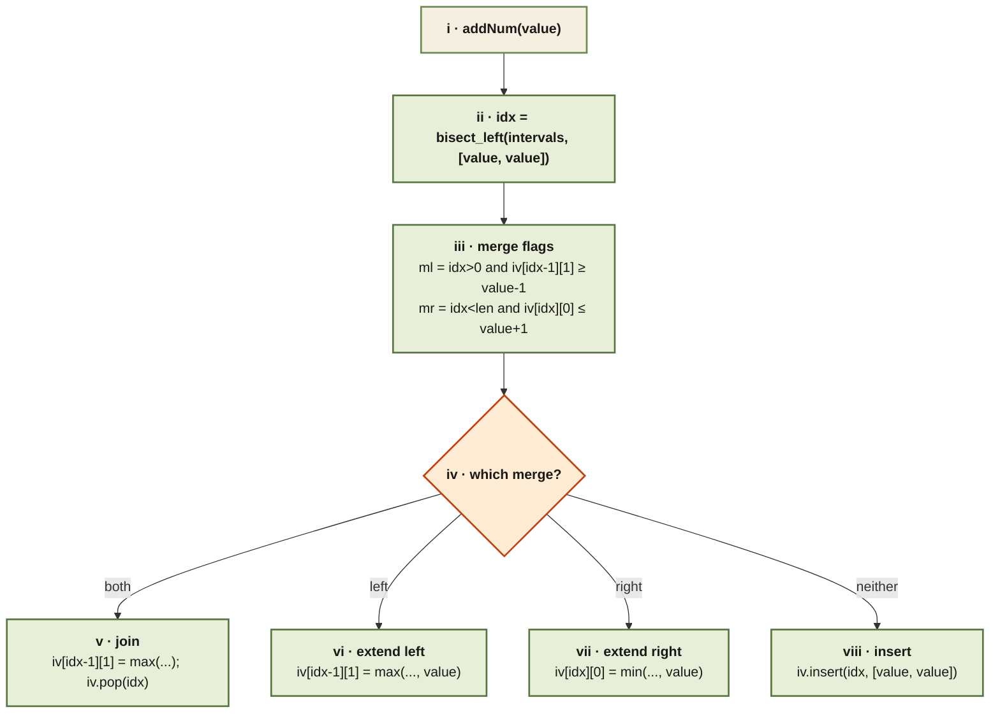

<Callout type="insight" title="Binary-search the slot, then merge with neighbours">
  Each `addNum(value)` call binary-searches the sorted interval list for
  its insertion point, then chooses between four outcomes based on
  whether the new value is adjacent to its left neighbour, its right
  neighbour, both, or neither.
</Callout>

## Data Stream — control flow

<FlowLegendGrid items={[
  { numeral: 'i',    name: 'Entry',              description: 'New value arrives; the interval list is kept sorted by start.' },
  { numeral: 'ii',   name: 'Binary search',      description: '`bisect_left` finds the first interval whose start is ≥ value.' },
  { numeral: 'iii',  name: 'Merge flags',        description: 'Compare `value` against both neighbours; `value-1` and `value+1` are the adjacency probes.' },
  { numeral: 'iv',   name: 'Four-way switch',    description: 'Pick exactly one branch — left, right, both, or neither.' },
  { numeral: 'v',    name: 'Join both',          description: 'Extend the left neighbour through the right one, then pop the right.' },
  { numeral: 'vi',   name: 'Extend left',        description: '`iv[idx-1][1] = max(iv[idx-1][1], value)`.' },
  { numeral: 'vii',  name: 'Extend right',       description: '`iv[idx][0] = min(iv[idx][0], value)`.' },
  { numeral: 'viii', name: 'Insert fresh',       description: 'Neither neighbour is adjacent — drop in `[value, value]` at `idx`.' },
]} />
