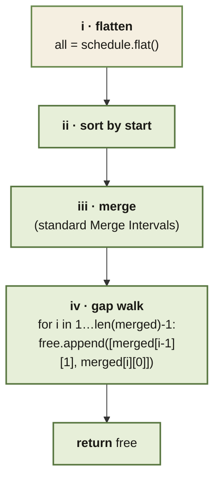

<Callout type="insight" title="Merge Intervals, then read the gaps">
  Employee Free Time is Merge Intervals plus one extra walk — the gaps
  between merged blocks are the answer. The legend below decodes each
  numbered step.
</Callout>

## Employee Free Time — control flow

<FlowLegendGrid items={[
  { numeral: 'i',   name: 'Flatten',         description: 'Collapse the per-employee lists into one big list of intervals.' },
  { numeral: 'ii',  name: 'Sort by start',   description: 'Prep for the merge step — overlaps must be adjacent.' },
  { numeral: 'iii', name: 'Merge intervals', description: 'Same Merge Intervals template — extend last bucket on overlap, otherwise push a new one.' },
  { numeral: 'iv',  name: 'Gap walk',        description: 'For consecutive merged intervals, the gap `[prev.end, next.start]` is a free-time window.' },
]} />
