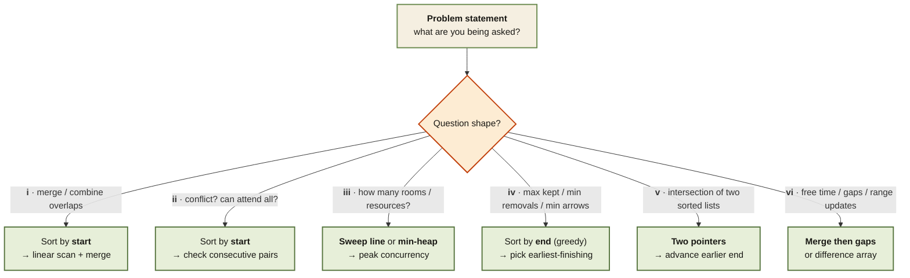

<Callout type="insight" title="One-picture decision flow">
  Every interval problem reduces to the same opening move: look at the
  question wording, pick a sort order, then walk the list with one of five
  templates. This diagram is that decision flow. The legend below maps
  each branch to the patterns where it shows up.
</Callout>

## Picking the right interval template

<FlowLegendGrid items={[
  { numeral: 'i',   name: 'Merge / combine overlaps',        description: 'Sort by start, walk the list, extend or start a new bucket. Template for Merge Intervals, Insert Interval, Employee Free Time.' },
  { numeral: 'ii',  name: 'Conflict detection',              description: 'Sort by start; if any `intervals[i].start < intervals[i-1].end`, they overlap. Meeting Rooms I.' },
  { numeral: 'iii', name: 'How many rooms / resources?',     description: 'Sweep line (`+1` on start, `-1` on end, take peak) or min-heap of end times. Meeting Rooms II.' },
  { numeral: 'iv',  name: 'Greedy optimisation',             description: 'Sort by end, keep the interval that finishes first. Non-Overlapping Intervals, Min Arrows, Activity Selection.' },
  { numeral: 'v',   name: 'Two sorted lists intersection',   description: 'Two pointers; at each step compute `[max(starts), min(ends)]` and advance the pointer whose end is smaller. Interval List Intersections.' },
  { numeral: 'vi',  name: 'Gaps / free time',                description: 'Merge everything, then the gaps between merged intervals are the answer. Employee Free Time.' },
]} />
