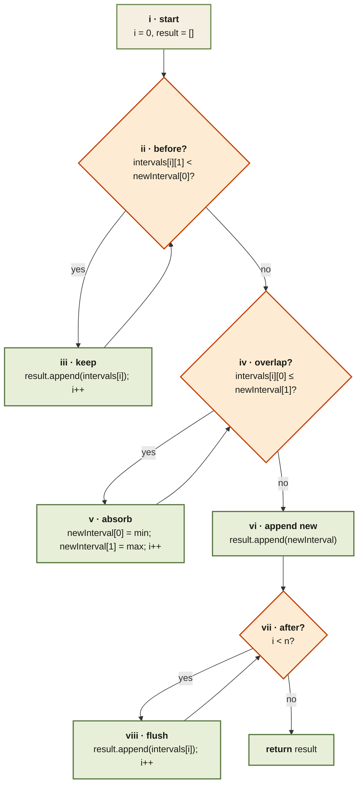

<Callout type="insight" title="Three-phase sweep">
  Because the input list is already sorted and non-overlapping, the
  algorithm is three consecutive while-loops — one per phase. The legend
  below walks each numbered step.
</Callout>

## Insert Interval — control flow

<FlowLegendGrid items={[
  { numeral: 'i',    name: 'Start',             description: 'Pointer `i` at 0; empty result list.' },
  { numeral: 'ii',   name: 'Phase 1 test',      description: 'Interval ends strictly before the new one starts → no overlap.' },
  { numeral: 'iii',  name: 'Keep (before)',     description: 'Append as-is and advance `i`.' },
  { numeral: 'iv',   name: 'Phase 2 test',      description: 'Interval starts at or before the new one ends → overlaps the new interval.' },
  { numeral: 'v',    name: 'Absorb',            description: 'Expand `newInterval`: `min` the start, `max` the end. `i++`.' },
  { numeral: 'vi',   name: 'Append merged',     description: 'Once the merge loop exits, push the (possibly expanded) `newInterval` once.' },
  { numeral: 'vii',  name: 'Phase 3 test',      description: 'Any remaining intervals are entirely after the new one.' },
  { numeral: 'viii', name: 'Flush tail',        description: 'Append the rest in order and return.' },
]} />
