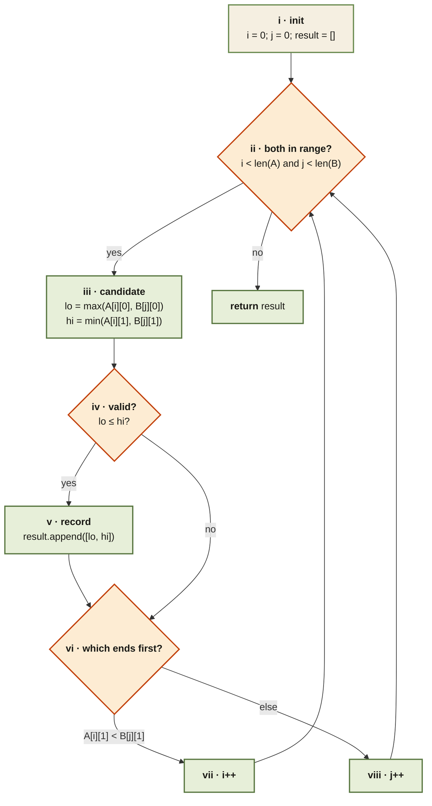

<Callout type="insight" title="Two pointers, one decision per step">
  Compute the candidate intersection from the pair `A[i]` and `B[j]`; if
  valid, record it. Then advance the pointer on the interval that ends
  first — it can't intersect anything else from the other list.
</Callout>

## Interval List Intersections — control flow

<FlowLegendGrid items={[
  { numeral: 'i',    name: 'Initialise',       description: 'Two pointers at 0, empty result list.' },
  { numeral: 'ii',   name: 'Loop guard',       description: 'Continue while both lists still have intervals.' },
  { numeral: 'iii',  name: 'Candidate',        description: '`lo = max(starts)`, `hi = min(ends)` — the overlap formula.' },
  { numeral: 'iv',   name: 'Validity',         description: '`lo ≤ hi` → real intersection; otherwise the intervals don’t overlap.' },
  { numeral: 'v',    name: 'Record',           description: 'Push `[lo, hi]` onto the result.' },
  { numeral: 'vi',   name: 'Which ends first', description: 'The interval with the smaller end time cannot intersect anything else from the other list — drop it.' },
  { numeral: 'vii',  name: 'Advance A',        description: '`i++` when `A[i][1] < B[j][1]`.' },
  { numeral: 'viii', name: 'Advance B',        description: '`j++` otherwise (including ties).' },
]} />
