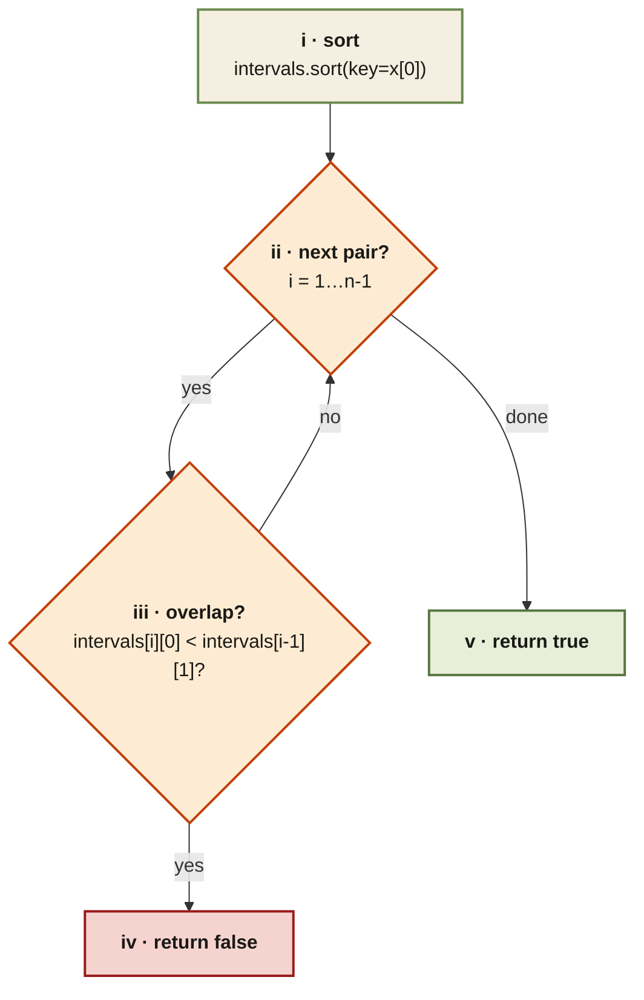

<Callout type="insight" title="Consecutive-pair check">
  The whole algorithm is a sort followed by one linear scan that bails on
  the first overlap. The legend below decodes each numbered step.
</Callout>

## Meeting Rooms I — control flow

<FlowLegendGrid items={[
  { numeral: 'i',   name: 'Sort by start', description: 'Overlapping meetings become adjacent, so we can check with a one-pass loop.' },
  { numeral: 'ii',  name: 'Iterate pairs', description: 'Walk from index 1 to `n-1` comparing `intervals[i]` with `intervals[i-1]`.' },
  { numeral: 'iii', name: 'Overlap check', description: '`intervals[i][0] < intervals[i-1][1]` — next meeting starts before previous ends.' },
  { numeral: 'iv',  name: 'Return false',  description: 'First overlap detected → impossible to attend all.' },
  { numeral: 'v',   name: 'Return true',   description: 'Loop finished with no conflicts → every meeting is attendable.' },
]} />
