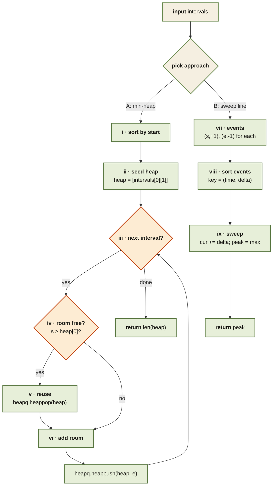

<Callout type="insight" title="Two algorithms, one answer">
  Both approaches compute the peak number of simultaneously-active
  meetings. Min-heap tracks live rooms by their end time; sweep line
  tracks a running delta of starts and ends. The diagram shows both
  paths; the legend breaks each numbered step down.
</Callout>

## Meeting Rooms II — control flow

<FlowLegendGrid items={[
  { numeral: 'i',    name: 'Sort by start',         description: 'Heap approach: so we process meetings in the order they begin.' },
  { numeral: 'ii',   name: 'Seed heap',             description: 'Put the first meeting’s end time in as the first active room.' },
  { numeral: 'iii',  name: 'Iterate',               description: 'For each remaining interval `(s, e)`.' },
  { numeral: 'iv',   name: 'Room-free check',       description: '`s >= heap[0]`: the earliest-ending active room has already ended, so we can reuse it.' },
  { numeral: 'v',    name: 'Reuse',                 description: '`heappop(heap)` — free the room.' },
  { numeral: 'vi',   name: 'Add room',              description: 'If no room is free, the push below simply grows the heap by 1. Either way we push the new end.' },
  { numeral: 'vii',  name: 'Build events',          description: 'Sweep approach: `(start, +1)` and `(end, -1)` for each meeting.' },
  { numeral: 'viii', name: 'Sort events',           description: 'By `(time, delta)` — ends (`-1`) tie-break before starts (`+1`) so back-to-back meetings share a room.' },
  { numeral: 'ix',   name: 'Sweep',                 description: 'Running sum gives active rooms at each moment; track the peak.' },
]} />
