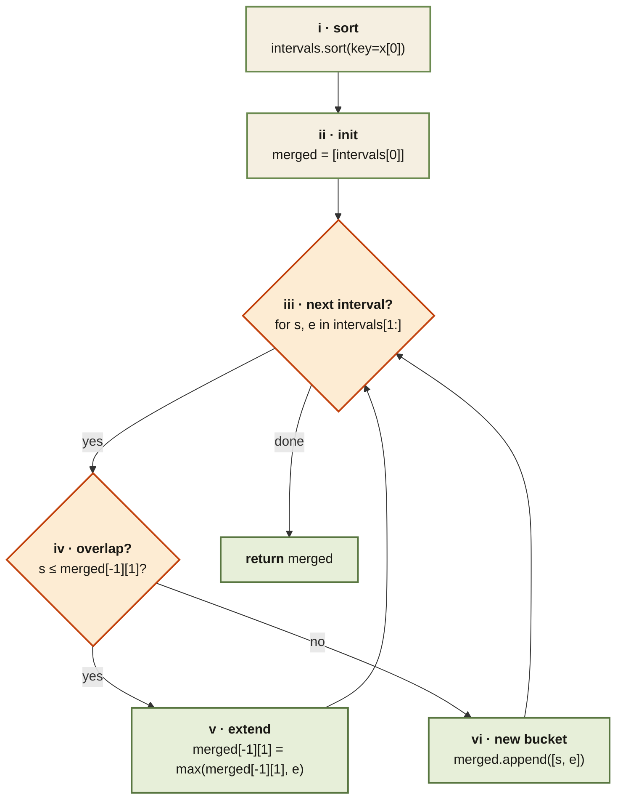

<Callout type="insight" title="The merge algorithm in one flowchart">
  After sorting by start, the algorithm is a single-pass loop with one
  decision per interval — overlap with the last bucket or start a new one.
  The legend below walks each numbered step.
</Callout>

## Merge Intervals — control flow

<FlowLegendGrid items={[
  { numeral: 'i',   name: 'Sort by start',   description: 'Puts overlapping intervals next to each other. This is why the rest of the algorithm is a single linear scan.' },
  { numeral: 'ii',  name: 'Seed the output', description: '`merged = [intervals[0]]`. The first interval is always the first bucket.' },
  { numeral: 'iii', name: 'Iterate',         description: 'Walk intervals from index 1 onwards.' },
  { numeral: 'iv',  name: 'Overlap check',   description: '`s ≤ merged[-1][1]`. `≤` (not `<`) so touching endpoints `[1,2] + [2,3]` merge.' },
  { numeral: 'v',   name: 'Extend',          description: '`merged[-1][1] = max(merged[-1][1], e)`. The `max` handles containment for free.' },
  { numeral: 'vi',  name: 'New bucket',      description: 'No overlap — push `[s, e]` as a fresh bucket. Return `merged` when done.' },
]} />
