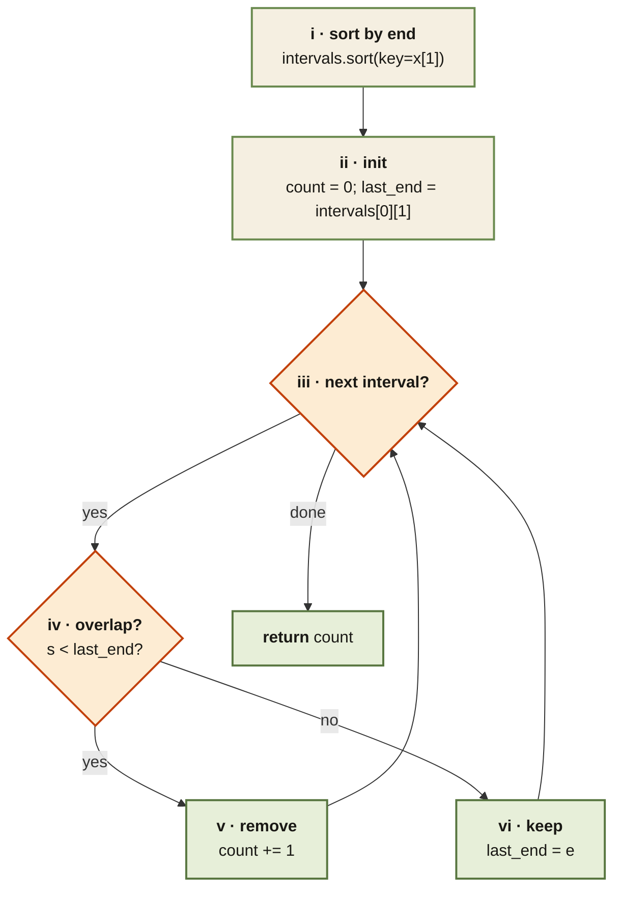

<Callout type="insight" title="Greedy by earliest finish">
  Sort by end time, then walk the list with one decision per interval —
  keep it (and update `last_end`) or remove it (and increment `count`).
  The legend below decodes each numbered step.
</Callout>

## Non-Overlapping Intervals — control flow

<FlowLegendGrid items={[
  { numeral: 'i',   name: 'Sort by end',      description: 'Greedy correctness depends on this — process the earliest-finishing interval first.' },
  { numeral: 'ii',  name: 'Initialise',       description: '`count = 0`; `last_end` = end of the first (earliest-finishing) interval.' },
  { numeral: 'iii', name: 'Iterate',          description: 'Walk the remaining intervals from index 1.' },
  { numeral: 'iv',  name: 'Overlap check',    description: '`s < last_end` — the current interval starts inside the kept one.' },
  { numeral: 'v',   name: 'Remove',           description: 'Increment `count`; do NOT update `last_end` (we are discarding this interval).' },
  { numeral: 'vi',  name: 'Keep',             description: 'No overlap — move `last_end` to this interval’s end and continue.' },
]} />
