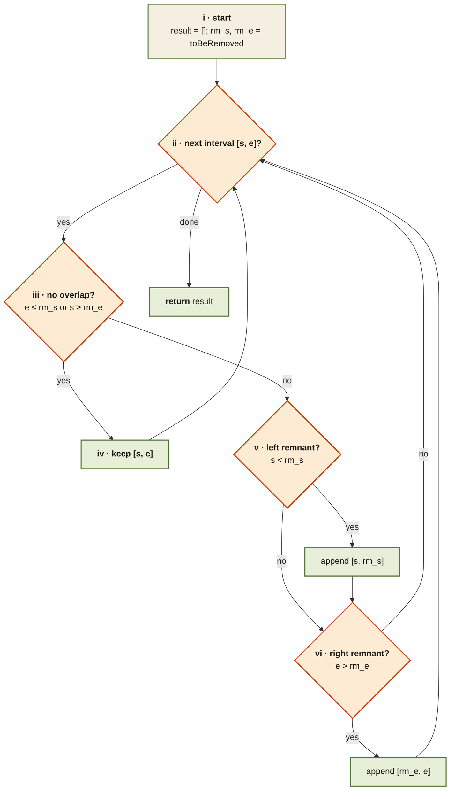

<Callout type="insight" title="Single pass, three cases">
  Each interval is classified as "no overlap", "left remnant", or "right
  remnant" — and an interval that straddles the removal range can produce
  both remnants. The legend below decodes each numbered branch.
</Callout>

## Remove Interval — control flow

<FlowLegendGrid items={[
  { numeral: 'i',   name: 'Start',           description: 'Empty result list; unpack the removal range.' },
  { numeral: 'ii',  name: 'Iterate',         description: 'Walk each interval `[s, e]`.' },
  { numeral: 'iii', name: 'No-overlap test', description: '`e ≤ rm_s` (entirely before) OR `s ≥ rm_e` (entirely after).' },
  { numeral: 'iv',  name: 'Keep',            description: 'Push the interval unchanged.' },
  { numeral: 'v',   name: 'Left remnant?',   description: '`s < rm_s` — part of the interval is left of the removal zone.' },
  { numeral: 'vi',  name: 'Right remnant?',  description: '`e > rm_e` — part of the interval is right of the removal zone.' },
]} />
