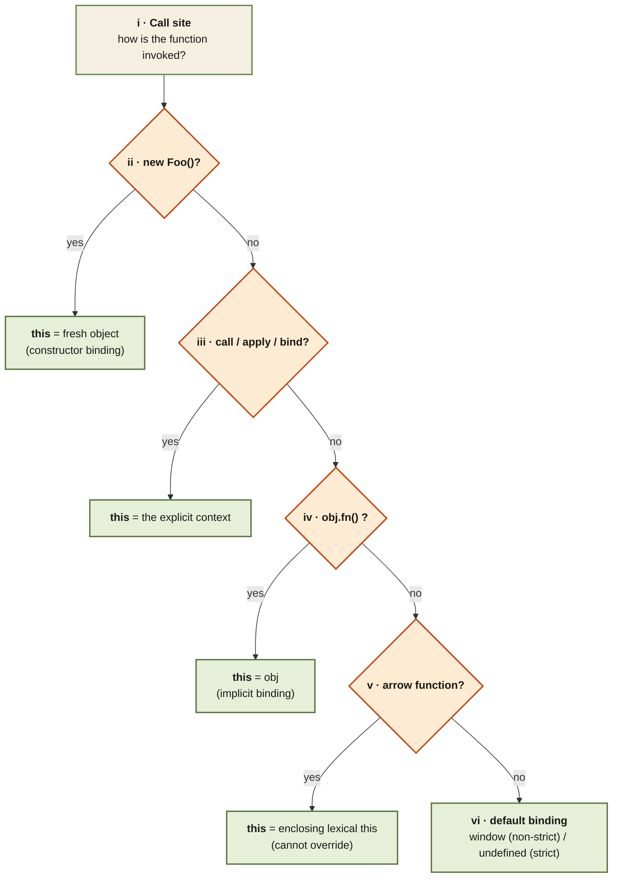

<Callout type="insight" title="One-picture recall">
  When JS resolves `this`, it walks five rules in priority order and
  stops at the first match. `new` wins over everything; explicit
  binding beats implicit; default binding is the fallback. Arrow
  functions sidestep the whole ladder — they have no own `this` and
  inherit from the enclosing scope. The diagram below traces a call
  site through the ladder.
</Callout>

## The five rules of `this` — priority order

<FlowLegendGrid items={[
  { numeral: 'i',    name: 'Call site',          description: 'The exact way the function is invoked decides this — not where the function was declared.' },
  { numeral: 'ii',   name: 'new Foo()',          description: 'Highest priority. Constructor binds this to a brand-new empty object.' },
  { numeral: 'iii',  name: 'call / apply / bind', description: 'Explicit binding: you pass the context directly. bind returns a new function with this locked.' },
  { numeral: 'iv',   name: 'obj.fn()',           description: 'Implicit binding: this = the object before the dot. Lose the dot → lose the binding.' },
  { numeral: 'v',    name: 'Arrow function',     description: 'No own this. Inherits from the enclosing lexical scope. call/apply/bind cannot change it.' },
  { numeral: 'vi',   name: 'Default binding',    description: 'Fallback when none of the above match. window in non-strict mode, undefined in strict mode.' },
]} />
