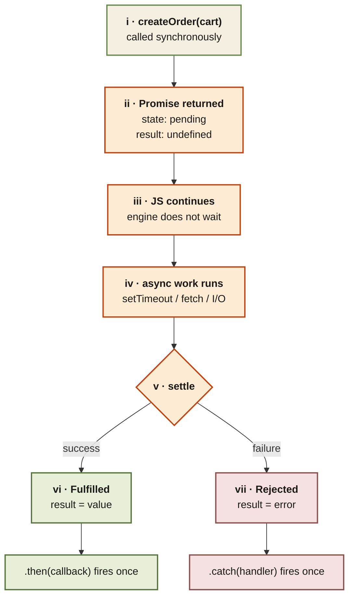

<Callout type="insight" title="One-picture recall">
  When you call an async function that returns a promise, JS hands you
  back a placeholder object immediately — pending, empty, and yours.
  The engine does not wait; it continues other work. When the async
  operation settles, the promise flips to fulfilled (with a value) or
  rejected (with an error), and any `.then` or `.catch` you attached
  fires exactly once. The diagram below traces that lifecycle.
</Callout>

## Promise lifecycle — from call to settled

<FlowLegendGrid items={[
  { numeral: 'i',    name: 'createOrder(cart)',  description: 'The async function is called. It does not block — it returns immediately.' },
  { numeral: 'ii',   name: 'Promise returned',   description: 'A placeholder object in the pending state. Result is undefined. We can attach .then/.catch to it right now.' },
  { numeral: 'iii',  name: 'JS continues',       description: 'The engine continues executing other code. Call stack is never blocked while the async work runs.' },
  { numeral: 'iv',   name: 'async work runs',    description: 'The actual async operation (timer, network, I/O) runs outside the call stack via Web APIs.' },
  { numeral: 'v',    name: 'Settle',             description: 'When the async work completes, the executor calls resolve(value) or reject(error). Settlement is permanent.' },
  { numeral: 'vi',   name: 'Fulfilled',          description: 'State flips to fulfilled, result becomes the value. Every attached .then fires exactly once.' },
  { numeral: 'vii',  name: 'Rejected',           description: 'State flips to rejected, result becomes the error. Every attached .catch fires exactly once.' },
]} />
