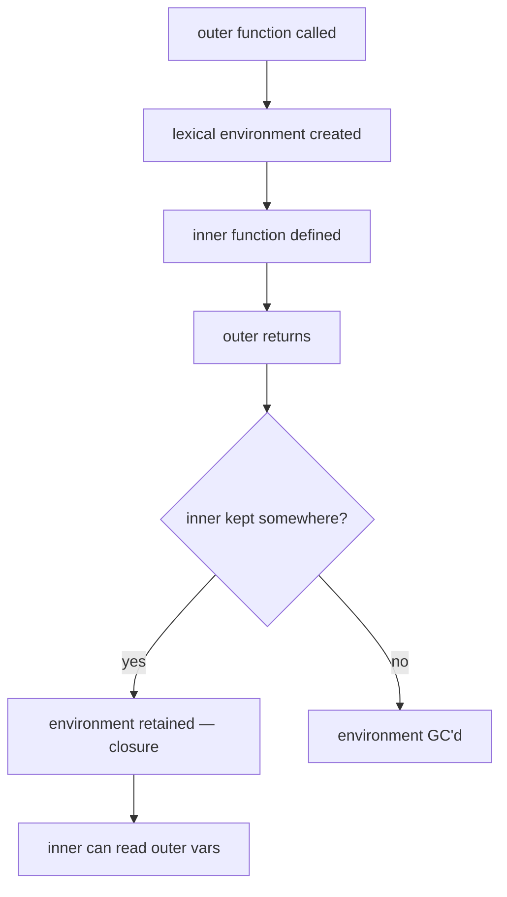

## How a closure forms

```mermaid
flowchart TD
    A[outer function called] --> B[lexical environment created]
    B --> C[inner function defined]
    C --> D[outer returns]
    D --> E{inner kept somewhere?}
    E -->|yes| F[environment retained — closure]
    E -->|no| G[environment GC'd]
    F --> H[inner can read outer vars]
```

The closure exists the moment the inner function is kept alive past the outer's return.
