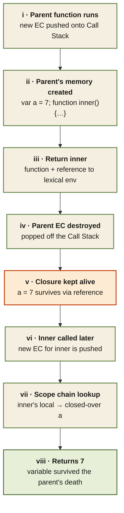

<Callout type="insight" title="One-picture recall">
  A closure is born when an inner function is returned from its parent.
  The parent's Execution Context is destroyed, but the variables the
  inner function references are preserved and travel with it. This
  diagram traces that handover — from parent call, through the return,
  to a much later invocation that still reads the parent's state. The
  legend below decodes each step.
</Callout>

## Closure formation — the variable that outlived its context

<FlowLegendGrid items={[
  { numeral: 'i',    name: 'Parent runs',         description: 'Call stack pushes the parent function\'s Execution Context — a fresh lexical environment is created.' },
  { numeral: 'ii',   name: 'Memory created',      description: 'Parent\'s variables (like `var a = 7`) and inner function declarations get their memory slots.' },
  { numeral: 'iii',  name: 'Return inner',        description: 'The inner function is returned along with its reference to the parent\'s lexical environment — not just its code.' },
  { numeral: 'iv',   name: 'Parent EC destroyed', description: 'Parent returns. Its Execution Context is popped off the Call Stack.' },
  { numeral: 'v',    name: 'Variable preserved',  description: 'Because the returned inner function still references them, the parent\'s variables escape garbage collection. That persistence is the closure.' },
  { numeral: 'vi',   name: 'Inner called later',  description: 'When the caller eventually invokes the returned function, a new EC is pushed for `inner` — its lexical parent reference still points at the preserved environment.' },
  { numeral: 'vii',  name: 'Scope chain lookup',  description: 'Reading `a` inside inner misses local, walks the outer reference, and finds the closed-over `a = 7`.' },
  { numeral: 'viii', name: 'Value returned',      description: 'Inner prints / returns 7. The parent is long gone, but the variable survived inside the closure.' },
]} />
