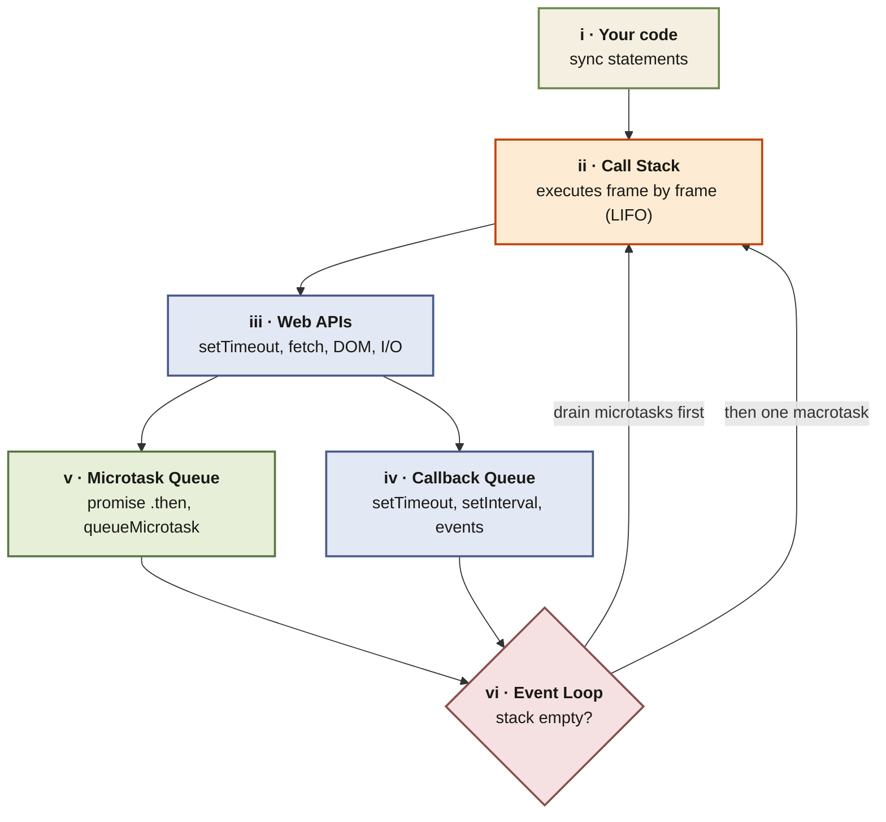

<Callout type="insight" title="One-picture recall">
  Every async concept in the course — setTimeout, promises, fetch,
  `await` — routes through the same plumbing: call stack, Web APIs,
  microtask queue, callback queue, and the event loop that ties them
  together. Microtasks always drain before the next macrotask. The
  diagram below is the architecture you should be able to redraw in
  an interview.
</Callout>

## The event loop — the architecture behind every async concept

<FlowLegendGrid items={[
  { numeral: 'i',   name: 'Your code',       description: 'The source you wrote — synchronous statements, function declarations, and calls that kick off async work.' },
  { numeral: 'ii',  name: 'Call Stack',      description: 'LIFO frame stack. Pushes on call, pops on return. Never blocked by async — await suspends and pops the frame.' },
  { numeral: 'iii', name: 'Web APIs',        description: 'Browser/Node APIs that run outside the stack — timers, fetch, DOM listeners, I/O. When they complete, they queue a callback.' },
  { numeral: 'iv',  name: 'Callback Queue',  description: 'Macrotask queue — setTimeout, setInterval, events, I/O. One macrotask per event-loop tick.' },
  { numeral: 'v',   name: 'Microtask Queue', description: 'Promise .then/.catch/.finally, queueMicrotask, MutationObserver. ALL drained before the next macrotask.' },
  { numeral: 'vi',  name: 'Event Loop',      description: 'The referee. When the stack is empty: drain every microtask, then take one macrotask. Repeat forever.' },
]} />
