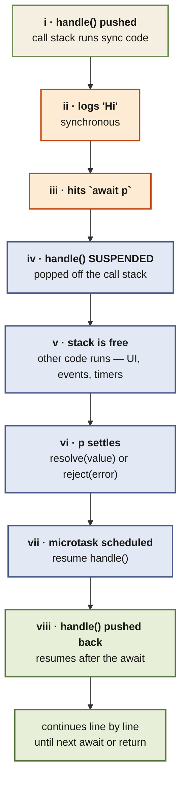

<Callout type="insight" title="One-picture recall">
  `await` does not block the engine — it suspends the current async
  function, pops it off the call stack, and lets the rest of the
  program run. When the awaited promise settles, the function is
  pushed back onto the stack and resumes exactly where it left off.
  The diagram below traces that journey, from synchronous start to
  microtask-driven resumption.
</Callout>

## await — what the call stack actually does

<FlowLegendGrid items={[
  { numeral: 'i',    name: 'handle() pushed',       description: 'The async function is called; its frame goes onto the call stack just like any function.' },
  { numeral: 'ii',   name: "logs 'Hi'",             description: 'The synchronous part of the function runs normally until the first await.' },
  { numeral: 'iii',  name: 'Hits `await p`',        description: 'Engine sees await — it will not block. It prepares to suspend the function.' },
  { numeral: 'iv',   name: 'Function SUSPENDED',    description: 'The frame is popped off the stack. The function is paused mid-execution, state preserved.' },
  { numeral: 'v',    name: 'Stack is free',         description: 'Other synchronous code, timers, event handlers, and microtasks run without blocking.' },
  { numeral: 'vi',   name: 'p settles',             description: 'The awaited promise resolves or rejects — settlement is permanent and one-shot.' },
  { numeral: 'vii',  name: 'Microtask scheduled',   description: 'The engine queues a microtask to resume the suspended function with the settled value.' },
  { numeral: 'viii', name: 'handle() resumes',      description: 'The frame is pushed back onto the stack. Execution continues after the await with the value.' },
]} />
