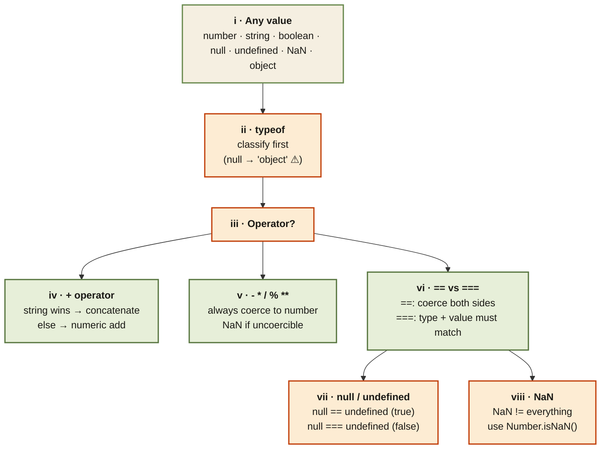

<Callout type="insight" title="One-picture recall">
  Every coercion trap in JavaScript comes from one decision tree: which
  side is a string, which operator is being applied, and whether to use
  `==` or `===`. This diagram walks a value through the coercion engine —
  from `typeof` through the `+` vs arithmetic split to equality. The
  legend below decodes each branch.
</Callout>

## The coercion decision tree — from value to result

<FlowLegendGrid items={[
  { numeral: 'i',    name: 'Any value',         description: 'JS has 7 primitive types + object. Every coercion starts from one of these values.' },
  { numeral: 'ii',   name: 'typeof first',      description: 'Classify the value. Remember: typeof null === "object" (historical bug), typeof NaN === "number", typeof [] === "object".' },
  { numeral: 'iii',  name: 'Operator branches', description: 'Behaviour depends on which operator is applied — + goes one way, arithmetic goes another, equality goes a third.' },
  { numeral: 'iv',   name: '+ operator',        description: 'If either operand is a string, both become strings and get concatenated. Otherwise numeric addition.' },
  { numeral: 'v',    name: '- * / % **',        description: 'Always coerce both operands to numbers (or NaN if impossible). No string path — "5" * "2" is 10.' },
  { numeral: 'vi',   name: '== vs ===',         description: '== performs type coercion before comparing. === demands identical type AND value. Always prefer ===.' },
  { numeral: 'vii',  name: 'null & undefined',  description: 'Special pair: null == undefined is true, but neither equals anything else with ==. null === undefined is false.' },
  { numeral: 'viii', name: 'NaN quirk',         description: 'NaN is not equal to anything, not even itself. Use Number.isNaN(x) or Object.is(x, NaN) to check.' },
]} />
