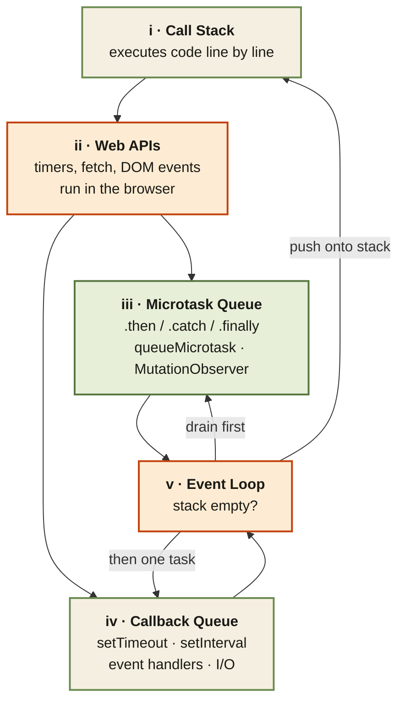

<Callout type="insight" title="One-picture recall">
  The event loop is JavaScript's concurrency model in one diagram. Code
  runs on the Call Stack. Async calls (setTimeout, fetch, promises) hand
  off to Web APIs in the browser. When ready, their callbacks land in one
  of two queues — microtasks (promises) or macrotasks (setTimeout). The
  Event Loop waits for the stack to clear, drains the microtask queue
  first, then takes one macrotask. Keep repeating. The legend below
  decodes each stop on the tour.
</Callout>

## Event loop tour — from Call Stack to the two queues and back

<FlowLegendGrid items={[
  { numeral: 'i',   name: 'Call Stack',      description: 'JS executes code line by line here. Only one thing runs at a time — this is what "single-threaded" means.' },
  { numeral: 'ii',  name: 'Web APIs',        description: 'When JS hits `setTimeout`, `fetch`, or adds an event listener, the work is handed off to the browser. The stack is free to continue.' },
  { numeral: 'iii', name: 'Microtask Queue', description: 'Promise callbacks (`.then`/`.catch`/`.finally`), `queueMicrotask`, MutationObserver — higher priority than the callback queue.' },
  { numeral: 'iv',  name: 'Callback Queue',  description: 'Also called the macrotask queue: setTimeout/setInterval callbacks, event handlers, I/O callbacks — lower priority.' },
  { numeral: 'v',   name: 'Event Loop',      description: 'The gatekeeper. When the Call Stack is empty, it fully drains the Microtask Queue, then takes one item from the Callback Queue and pushes it onto the stack. Repeat forever.' },
]} />
