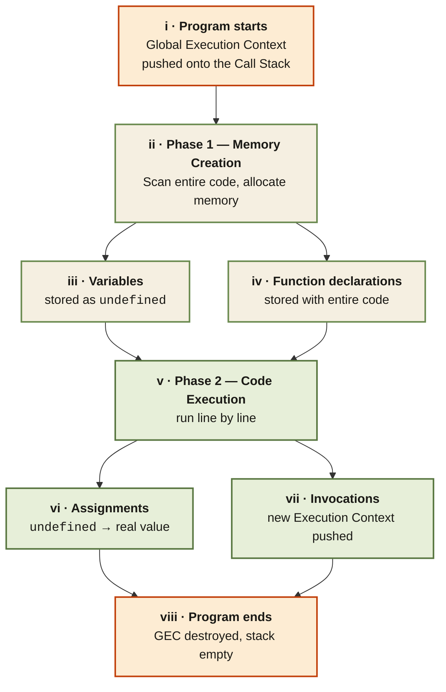

<Callout type="insight" title="One-picture recall">
  The Execution Context is a sealed container with two halves: Memory and
  Code. This diagram traces the two phases that run inside every context —
  first scan + allocate, then run line by line. The legend below decodes
  each half.
</Callout>

## Execution Context — Memory + Code, in two phases

<FlowLegendGrid items={[
  { numeral: 'i',    name: 'Program starts',   description: 'The Global Execution Context (GEC) is created and pushed onto the Call Stack.' },
  { numeral: 'ii',   name: 'Phase 1 — Memory', description: 'JS scans every line without executing and allocates memory for declarations.' },
  { numeral: 'iii',  name: 'Variables',        description: 'Every `var` is stored with the placeholder value `undefined`.' },
  { numeral: 'iv',   name: 'Functions',        description: 'Function declarations are stored with their entire body — not undefined.' },
  { numeral: 'v',    name: 'Phase 2 — Code',   description: 'Execution runs line by line, in order, on a single thread.' },
  { numeral: 'vi',   name: 'Assignments',      description: 'The placeholder `undefined` is replaced with the actual value written in code.' },
  { numeral: 'vii',  name: 'Invocations',      description: 'Calling a function creates a fresh Execution Context on top of the stack.' },
  { numeral: 'viii', name: 'Program ends',     description: 'GEC is destroyed and popped — the Call Stack is empty; execution is done.' },
]} />
