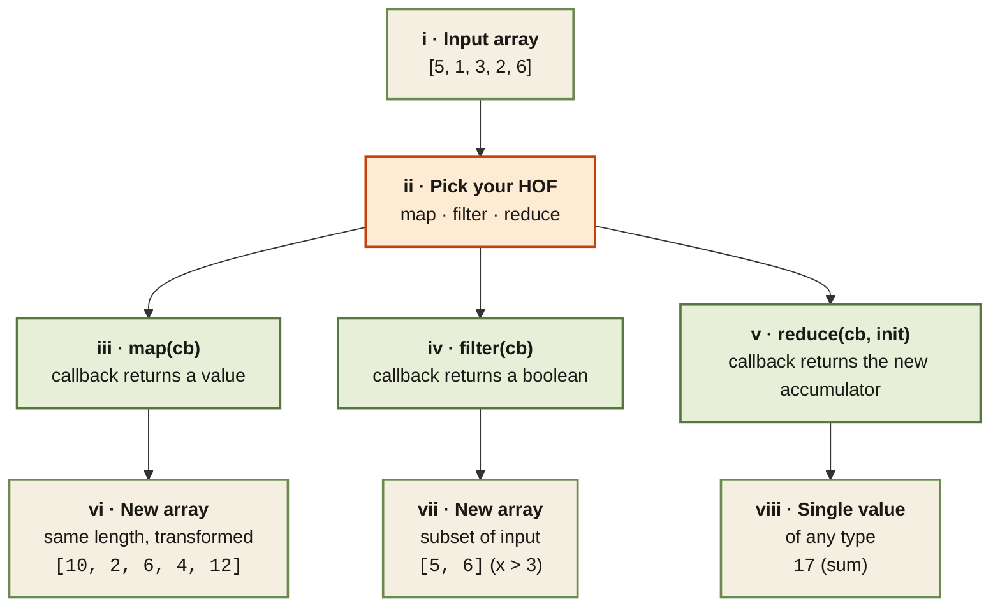

<Callout type="insight" title="One-picture recall">
  map, filter, and reduce are three specializations of the same shape —
  walk an array, call a callback, produce a result. Map transforms every
  element into a new array of equal length. Filter keeps only elements
  for which the callback is truthy. Reduce folds everything into one
  value. The legend below decodes each path an array can take through
  a higher-order function.
</Callout>

## The three musketeers — same shape, three outcomes

<FlowLegendGrid items={[
  { numeral: 'i',    name: 'Input array',      description: 'The array you call the method on. None of the three mutate it.' },
  { numeral: 'ii',   name: 'Pick your HOF',    description: 'map, filter, and reduce are all HOFs on Array.prototype — each takes a callback.' },
  { numeral: 'iii',  name: 'map(cb)',          description: 'Callback signature `(value, index, array)`. Whatever the callback returns becomes the new element.' },
  { numeral: 'iv',   name: 'filter(cb)',       description: 'Same callback signature. Truthy return keeps the element; falsy drops it.' },
  { numeral: 'v',    name: 'reduce(cb, init)', description: 'Callback `(acc, value, index, array)`. Return the new accumulator. Always pass an initial value.' },
  { numeral: 'vi',   name: 'map output',       description: 'A new array of the same length, with each element transformed.' },
  { numeral: 'vii',  name: 'filter output',    description: 'A new array containing only the elements that passed the predicate.' },
  { numeral: 'viii', name: 'reduce output',    description: 'A single value of any type — a sum, max, object, grouped map, flattened array, anything.' },
]} />
