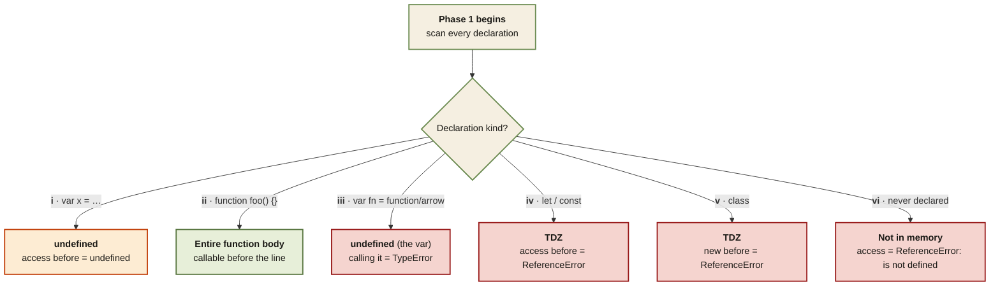

<Callout type="insight" title="One-picture recall">
  What happens when the engine hits each declaration kind? This diagram
  is a decision flow from the Memory Creation Phase — the single source
  of truth for whether a name shows up as `undefined`, a full function,
  or an error. The legend below decodes each branch.
</Callout>

## Hoisting — what each declaration gets in Phase 1

<FlowLegendGrid items={[
  { numeral: 'i',   name: 'var',                 description: 'Hoisted as `undefined`. Safe to read before the line — you get undefined, not an error.' },
  { numeral: 'ii',  name: 'function declaration', description: 'Hoisted with the whole body. Callable before the line — this is why.' },
  { numeral: 'iii', name: 'function / arrow expr', description: 'The `var` holds `undefined`; invoking it throws TypeError: is not a function.' },
  { numeral: 'iv',  name: 'let / const',         description: 'Hoisted, but held in the Temporal Dead Zone. Access = ReferenceError: Cannot access before initialization.' },
  { numeral: 'v',   name: 'class',               description: 'Same TDZ rule as let/const. `new MyClass()` before the class line = ReferenceError.' },
  { numeral: 'vi',  name: 'never declared',      description: 'No entry in memory at all. Reading the name = ReferenceError: x is not defined.' },
]} />
