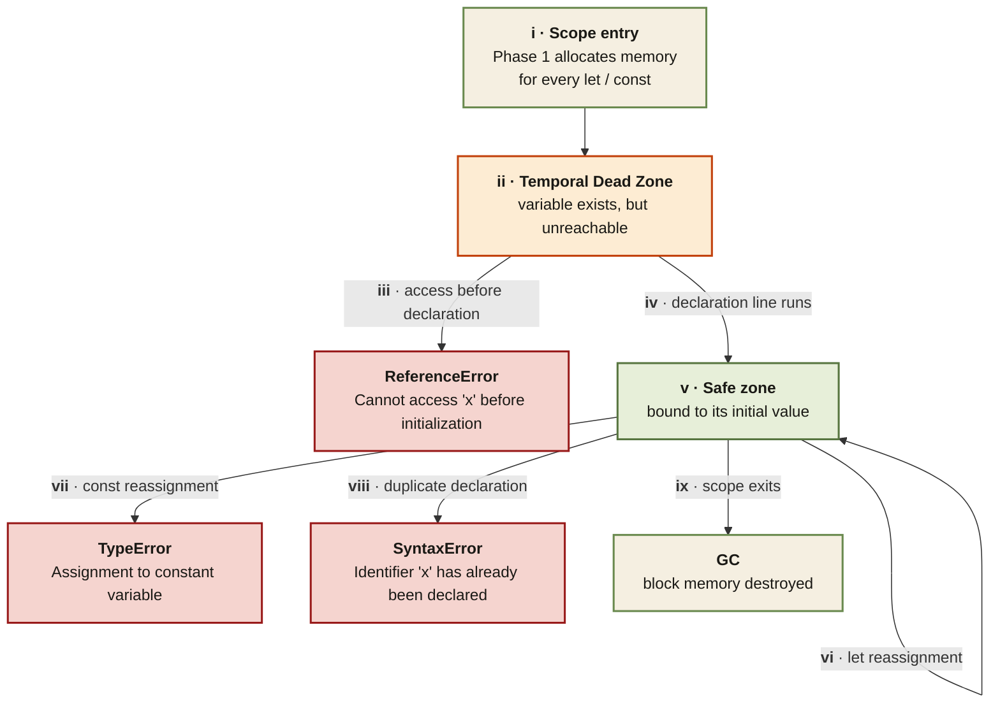

<Callout type="insight" title="One-picture recall">
  Every `let` and `const` begins its life hoisted but unreachable — the
  Temporal Dead Zone. This diagram traces the lifecycle inside a single
  scope: enter the block, hit the TDZ, cross the declaration line, and
  finally reach the safe zone. The legend below decodes each state and
  the error each transition can produce.
</Callout>

## let / const lifecycle — from TDZ to safe zone

<FlowLegendGrid items={[
  { numeral: 'i',    name: 'Scope entry',        description: 'When execution enters the scope, Phase 1 allocates memory for every `let` / `const` in that scope — before any code runs.' },
  { numeral: 'ii',   name: 'Temporal Dead Zone', description: 'Variable exists in memory but is flagged as unreachable. Lives in Script scope (top-level) or Block scope (inside `{ }`).' },
  { numeral: 'iii',  name: 'TDZ violation',      description: 'Reading, writing, or even `typeof` in the TDZ throws `ReferenceError: Cannot access \'x\' before initialization`.' },
  { numeral: 'iv',   name: 'Declaration runs',   description: 'The `let x = …` / `const x = …` line executes. The TDZ ends, the variable is bound to its initial value.' },
  { numeral: 'v',    name: 'Safe zone',          description: 'Normal access works. Reads return the value, `typeof` returns the type.' },
  { numeral: 'vi',   name: 'let reassignment',   description: '`let` allows rebinding to a new value. The variable stays in the safe zone.' },
  { numeral: 'vii',  name: 'const reassignment', description: '`const` forbids rebinding → `TypeError: Assignment to constant variable`. Mutating object properties is still allowed.' },
  { numeral: 'viii', name: 'Duplicate declaration', description: 'A second `let` / `const` / `var` with the same name in the same scope throws `SyntaxError` — the code never runs.' },
  { numeral: 'ix',   name: 'Scope exit',         description: 'When the block or function returns, block-scoped `let` / `const` memory is destroyed. Script-scope bindings live for the page.' },
]} />
