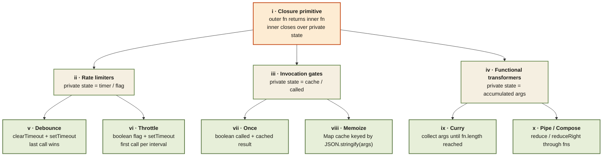

<Callout type="insight" title="One-picture recall">
  The "can you write it from scratch?" questions cluster into three
  families of closures: rate-limiters (debounce, throttle), invocation
  gates (once, memoize), and functional transformers (curry, pipe,
  compose). All three families use the same trick — return a new function
  that closes over private state. This diagram maps the patterns to the
  closure they all share. The legend below decodes each branch.
</Callout>

## The closure family tree — one pattern, many problems

<FlowLegendGrid items={[
  { numeral: 'i',    name: 'Closure primitive',       description: 'Every pattern here returns a new function that closes over some private state — timers, flags, caches, or accumulated args.' },
  { numeral: 'ii',   name: 'Rate limiters',           description: 'Control how often a function can fire. Private state is a timer handle or a boolean flag.' },
  { numeral: 'iii',  name: 'Invocation gates',        description: 'Control whether the function runs at all. Private state is a called flag or a results cache.' },
  { numeral: 'iv',   name: 'Functional transformers', description: 'Reshape how a function is called. Private state is either accumulated args (curry) or an ordered list of functions (pipe/compose).' },
  { numeral: 'v',    name: 'Debounce',                description: 'clearTimeout + setTimeout — runs fn delay ms after the LAST call. Good for search-as-you-type.' },
  { numeral: 'vi',   name: 'Throttle',                description: 'Boolean `inThrottle` flag — runs fn at most once per interval. Good for scroll/resize.' },
  { numeral: 'vii',  name: 'Once',                    description: 'Runs exactly once; subsequent calls return the cached result. Useful for init paths and "pay once" flows.' },
  { numeral: 'viii', name: 'Memoize',                 description: 'Cache keyed by JSON.stringify(args). Skips recomputation for identical inputs.' },
  { numeral: 'ix',   name: 'Curry',                   description: 'Collect args across calls; invoke the original once args.length ≥ fn.length. Enables partial application.' },
  { numeral: 'x',    name: 'Pipe / Compose',          description: 'Thread a value through a list of functions. pipe goes left→right (reduce); compose goes right→left (reduceRight).' },
]} />
