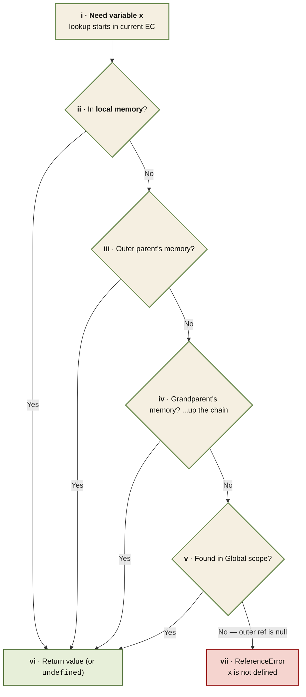

<Callout type="insight" title="One-picture recall">
  The scope chain is a single reference pointer per scope — from the
  innermost function outward to global, then `null`. This diagram traces
  the lookup for an identifier inside nested functions, visiting each
  lexical environment until it finds the value or runs out of chain. The
  legend below decodes each hop.
</Callout>

## The Scope Chain — variable lookup walks outward

<FlowLegendGrid items={[
  { numeral: 'i',   name: 'Lookup starts',        description: 'Any identifier reference triggers a lookup inside the currently executing function\'s lexical environment.' },
  { numeral: 'ii',  name: 'Local memory',         description: 'First check the function\'s own variables and parameters. Found here → stop, return the value.' },
  { numeral: 'iii', name: 'Parent\'s environment', description: 'Follow the outer environment reference to the function where this one was *lexically written* — not where it was called.' },
  { numeral: 'iv',  name: 'Climb the chain',      description: 'Repeat outward through each ancestor lexical environment. Inner → outer → grandparent → ... — one hop per level.' },
  { numeral: 'v',   name: 'Global scope',         description: 'The end of every chain. Global\'s outer reference is `null`. If it\'s not here, it isn\'t anywhere.' },
  { numeral: 'vi',  name: 'Hit',                  description: 'Variable found. Stops immediately at the first match — outer occurrences are shadowed.' },
  { numeral: 'vii', name: 'Miss',                 description: 'Chain exhausted with no match. `ReferenceError: x is not defined` is thrown.' },
]} />
