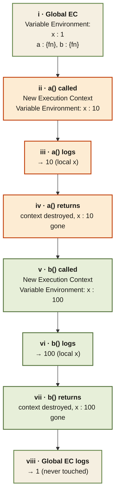

<Callout type="insight" title="One-picture recall">
  Three separate memory spaces for three same-named `x` variables.
  Global EC holds `x = 1`; `a()` creates a fresh Variable Environment
  with `x = 10`; `b()` does the same with `x = 100`. None of them
  interfere — each `x` lives and dies with its own Execution Context.
  The legend below decodes each step.
</Callout>

## Variable Environments — three x's, three contexts

<FlowLegendGrid items={[
  { numeral: 'i',    name: 'Global EC',      description: 'GEC pushed onto Call Stack. Variable Environment holds `x : 1`, `a : {fn}`, `b : {fn}`.' },
  { numeral: 'ii',   name: 'a() invoked',    description: 'New Execution Context pushed. Its Variable Environment allocates a fresh local `x` (undefined → 10).' },
  { numeral: 'iii',  name: 'a() logs',       description: '`console.log(x)` inside `a()` reads the **local** x = 10. The global `x` is invisible to it.' },
  { numeral: 'iv',   name: 'a() returns',    description: 'Context destroyed, popped. Local `x = 10` is garbage-collected.' },
  { numeral: 'v',    name: 'b() invoked',    description: 'New Execution Context pushed. A brand new `x` (undefined → 100) — no memory shared with `a()`.' },
  { numeral: 'vi',   name: 'b() logs',       description: '`console.log(x)` inside `b()` reads its own local x = 100. No collision with `a()`, no effect on global.' },
  { numeral: 'vii',  name: 'b() returns',    description: 'Context destroyed, popped. Local `x = 100` is garbage-collected.' },
  { numeral: 'viii', name: 'Global logs',    description: 'Back in GEC. `console.log(x)` reads global `x = 1` — unchanged throughout. Program ends.' },
]} />
