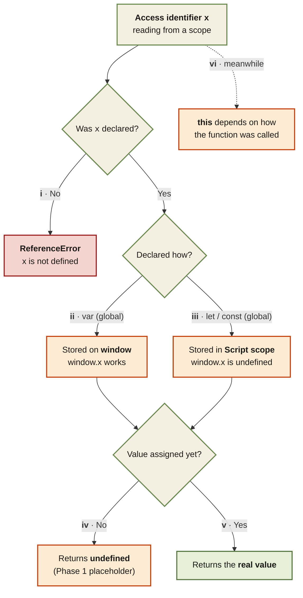

<Callout type="insight" title="One-picture recall">
  When you write an identifier, what comes back? This decision flow folds
  both topics together — first the engine checks whether the name was
  declared at all, then how it was declared (`var` vs `let`/`const`),
  then whether it has a value yet. The legend below decodes each branch.
</Callout>

## Accessing an identifier — what you actually get

<FlowLegendGrid items={[
  { numeral: 'i',   name: 'Never declared',        description: 'No entry in memory at all. Reading the name throws `ReferenceError: x is not defined` — it\'s an error, not a value.' },
  { numeral: 'ii',  name: 'var at global',         description: 'Attached to the `window` object. Readable as `x`, `this.x`, and `window.x` — all three are identical.' },
  { numeral: 'iii', name: 'let / const at global', description: 'Stored in the Script scope (separate memory). `window.x` is `undefined` — it never attaches to the global object.' },
  { numeral: 'iv',  name: 'Declared, unassigned',  description: 'Phase 1 put the placeholder `undefined` there. Accessing it returns `undefined` — declared, just no value yet.' },
  { numeral: 'v',   name: 'Declared + assigned',   description: 'Returns the real value written in code. This is the normal, happy path.' },
  { numeral: 'vi',  name: 'this — orthogonal',     description: '`this` is not resolved by the scope chain. Its value depends entirely on how the function was called (global / method / arrow / new / bound).' },
]} />
