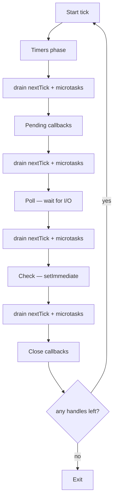

## One tick of the event loop

```mermaid
flowchart TD
    A[Start tick] --> B[Timers phase]
    B --> N1[drain nextTick + microtasks]
    N1 --> C[Pending callbacks]
    C --> N2[drain nextTick + microtasks]
    N2 --> D[Poll — wait for I/O]
    D --> N3[drain nextTick + microtasks]
    N3 --> E[Check — setImmediate]
    E --> N4[drain nextTick + microtasks]
    N4 --> F[Close callbacks]
    F --> G{any handles left?}
    G -->|yes| A
    G -->|no| H[Exit]
```

The nextTick + microtask drain between phases is why Promise.then can arrive earlier than
you'd expect from a setTimeout scheduled on the same line.
