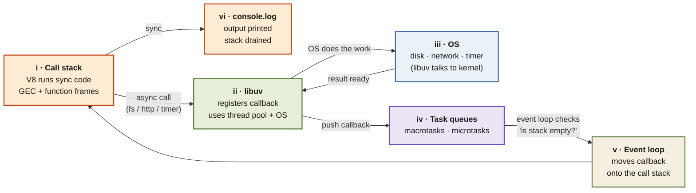

<Callout type="insight" title="One-picture recall">
  A single glance at how a line of Node.js code flows from V8's call stack
  through libuv to the OS and back. Sync work stays on the left; async
  work detours through libuv and the event loop before returning as a
  callback. The legend below decodes each phase.
</Callout>

## How async code flows through Node.js

<FlowLegendGrid items={[
  { numeral: 'i',   name: 'Call stack (V8)',    description: 'V8 executes synchronous code one frame at a time — GEC plus any active function contexts.' },
  { numeral: 'ii',  name: 'libuv',              description: 'C library bundled with Node. Registers async ops with their callbacks and uses the thread pool + OS syscalls to do the work.' },
  { numeral: 'iii', name: 'Operating system',   description: 'Disk, network, timers. libuv is the only part of Node that can talk to the kernel.' },
  { numeral: 'iv',  name: 'Task queues',        description: 'Macrotasks (timers, I/O callbacks) and microtasks (promises, queueMicrotask). Microtasks drain first.' },
  { numeral: 'v',   name: 'Event loop',         description: 'Checks whether the call stack is empty; if yes, moves the next ready callback onto it.' },
  { numeral: 'vi',  name: 'Output',             description: 'Sync output prints immediately; async output prints only after libuv + the event loop hand the callback back to V8.' },
]} />
