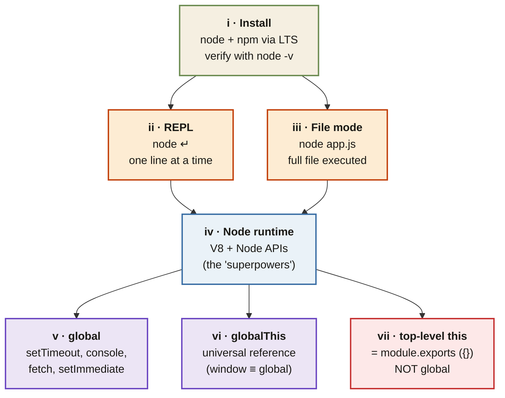

<Callout type="insight" title="One-picture recall">
  Your first Node.js workflow in a single frame: from installing the
  binary, to exploring in the REPL, to running a file, to reaching the
  runtime's global objects. The legend below decodes each phase.
</Callout>

## From install to globals — your first Node workflow

<FlowLegendGrid items={[
  { numeral: 'i',   name: 'Install',              description: 'Install the LTS build from nodejs.org — bundles Node + NPM. Verify with `node -v` / `npm -v`.' },
  { numeral: 'ii',  name: 'REPL',                 description: 'Interactive mode: type `node`, evaluate one line at a time. Great for quick experiments; nothing persists.' },
  { numeral: 'iii', name: 'File mode',            description: 'Write `app.js` in a folder, run with `node app.js`. The whole file executes top to bottom.' },
  { numeral: 'iv',  name: 'Node runtime',         description: 'V8 engine + Node APIs (fs, http, net, os). Runs your code in either REPL or file mode.' },
  { numeral: 'v',   name: 'global',               description: 'Node\'s global object. Provides setTimeout, setInterval, setImmediate, console, fetch, queueMicrotask.' },
  { numeral: 'vi',  name: 'globalThis',           description: 'ES2020 universal reference. In Node, `globalThis === global`. In browsers, `globalThis === window`.' },
  { numeral: 'vii', name: 'top-level `this`',     description: 'Trap: at the top level of a Node file, `this` is the empty `module.exports`, not the global object.' },
]} />
