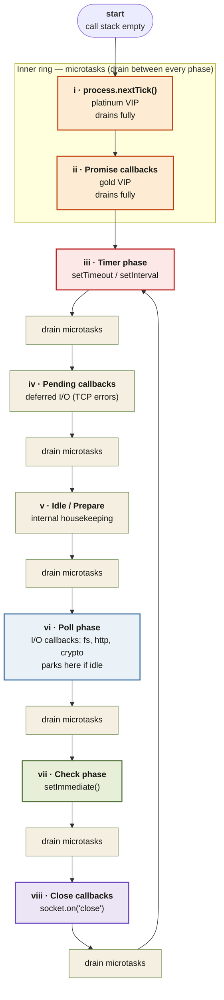

<Callout type="insight" title="One-picture recall">
  The dual-ring event loop: the outer ring cycles through the four main
  phases (Timer → Poll → Check → Close). The inner ring drains the two
  microtask queues (`process.nextTick()` first, then Promise callbacks)
  between every single phase transition. The legend below decodes each
  stop.
</Callout>

## Event loop — outer phases and inner microtask ring

<FlowLegendGrid items={[
  { numeral: 'i',    name: 'process.nextTick()',  description: 'Platinum VIP. Highest async priority. All queued nextTick callbacks drain first — including any scheduled during the drain.' },
  { numeral: 'ii',   name: 'Promise callbacks',   description: 'Gold VIP. .then / .catch / .finally and async/await continuations. Drain after nextTick, before any phase.' },
  { numeral: 'iii',  name: 'Timer phase',         description: 'Executes setTimeout / setInterval callbacks whose delay has elapsed. Delay is a minimum, not guaranteed.' },
  { numeral: 'iv',   name: 'Pending callbacks',   description: 'Deferred I/O callbacks — e.g. TCP error callbacks that slipped past their own phase.' },
  { numeral: 'v',    name: 'Idle / Prepare',      description: 'Internal Node.js housekeeping. Not exposed to user code.' },
  { numeral: 'vi',   name: 'Poll phase',          description: 'I/O results: fs, http, net, crypto callbacks. The loop parks here when idle, waiting for I/O from the OS.' },
  { numeral: 'vii',  name: 'Check phase',         description: 'setImmediate() callbacks. Always runs right after Poll — which is why setImmediate beats setTimeout(0) inside I/O.' },
  { numeral: 'viii', name: 'Close callbacks',     description: 'socket.on("close") and similar cleanup callbacks. Final stop before the loop cycles back to Timers.' },
]} />
