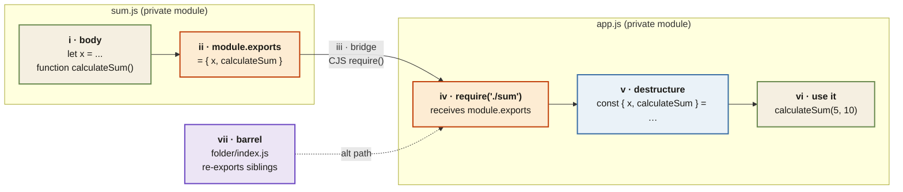

<Callout type="insight" title="One-picture recall">
  How two files talk to each other in Node.js. Private scopes on both
  sides; `module.exports` is the only legal door out, `require()` is the
  only door in. The legend below decodes each side.
</Callout>

## module.exports → require — the only legal bridge

<FlowLegendGrid items={[
  { numeral: 'i',   name: 'Module body',            description: 'Variables and functions live in the file\'s private scope. Nothing leaks by default.' },
  { numeral: 'ii',  name: 'module.exports',         description: 'The public door. Whatever you assign here becomes the module\'s return value.' },
  { numeral: 'iii', name: 'CJS bridge',             description: 'require("./sum") runs the file once, then returns its module.exports value.' },
  { numeral: 'iv',  name: 'require() in consumer',  description: 'Other file receives whatever was exported — a function, an object, a class, anything.' },
  { numeral: 'v',   name: 'Destructure',            description: 'The professional pattern: const { x, calculateSum } = require("./sum"). Clean, explicit, scannable.' },
  { numeral: 'vi',  name: 'Use the import',         description: 'Call the function, read the variable — just as if it were defined locally.' },
  { numeral: 'vii', name: 'Barrel (index.js)',      description: 'Put index.js inside a folder to group exports; require("./folder") auto-loads it.' },
]} />
