<Callout type="insight" title="One-picture recall">
  The full life of one program: V8 runs every sync line, three async
  offloads scatter work to libuv and the OS, then the call stack empties
  and the event loop takes over. Watch where each callback re-enters the
  call stack. The legend below decodes each stage.
</Callout>

## From `node app.js` to exit — every stage

```mermaid
flowchart TD
    Init["<b>i · Initialization</b><br/>V8 loads source<br/>libuv event loop idle"]
      --> Mem["<b>ii · Memory Creation</b><br/>GEC pushed<br/>a, b, c = undefined<br/>multiplyFn hoisted"]
    Mem --> Exec["<b>iii · Code Execution</b><br/>a = 10786<br/>b = 20987"]
    Exec --> N1["<b>iv · https.get offload</b><br/>→ OS kernel<br/>(callback A registered)"]
    N1 --> N2["<b>v · setTimeout offload</b><br/>→ libuv timer<br/>(callback B, 5000 ms)"]
    N2 --> N3["<b>vi · fs.readFile offload</b><br/>→ libuv thread pool<br/>(callback C)"]
    N3 --> Mul["<b>vii · multiplyFn FEC</b><br/>x * y = 226215682<br/>FEC popped"]
    Mul --> Turn["<b>viii · console.log(c)</b><br/>GEC pops<br/>call stack EMPTY"]
    Turn --> Loop["<b>ix · Event loop active</b><br/>cycles phases + microtasks"]
    Loop --> Poll1["<b>x · Poll — readFile done</b><br/>File Data …"]
    Poll1 --> Poll2["<b>xi · Poll — API response</b><br/>res.secret"]
    Poll2 --> Timer["<b>xii · Timers — 5 s elapsed</b><br/>setTimeout"]
    Timer --> Exit["<b>xiii · Shutdown</b><br/>uv_run returns<br/>exit code 0"]

    classDef init fill:#eaf2f8,stroke:#3a6ea5,stroke-width:2px,color:#1a1915;
    classDef sync fill:#f5efe1,stroke:#6a8a4f,stroke-width:2px,color:#1a1915;
    classDef offload fill:#fdecd3,stroke:#c2410c,stroke-width:2px,color:#1a1915;
    classDef loop fill:#ece5f5,stroke:#6b46c1,stroke-width:2px,color:#1a1915;
    classDef done fill:#e7efd9,stroke:#587640,stroke-width:2px,color:#1a1915;
    class Init,Mem init
    class Exec,Mul,Turn sync
    class N1,N2,N3 offload
    class Loop,Poll1,Poll2,Timer loop
    class Exit done
```

<FlowLegendGrid items={[
  { numeral: 'i',    name: 'Initialization',     description: 'V8 loads the source string; libuv event loop is initialized and idle.' },
  { numeral: 'ii',   name: 'Memory creation',    description: 'GEC pushed; variables set to undefined; multiplyFn fully hoisted with its body.' },
  { numeral: 'iii',  name: 'Code execution',     description: 'Sync phase begins — a and b receive their values on the call stack.' },
  { numeral: 'iv',   name: 'https.get offload',  description: 'Network I/O → OS kernel (epoll / kqueue / IOCP). Callback A stored in libuv.' },
  { numeral: 'v',    name: 'setTimeout offload', description: 'Timer registered with libuv; callback B waits for ~5000 ms to elapse.' },
  { numeral: 'vi',   name: 'fs.readFile offload', description: 'File I/O assigned to a libuv thread-pool worker; callback C stored.' },
  { numeral: 'vii',  name: 'multiplyFn FEC',     description: 'Sync function call — FEC pushed, 10786 × 20987 = 226215682, FEC popped.' },
  { numeral: 'viii', name: 'console.log(c)',     description: 'Last sync line runs; GEC pops; call stack is EMPTY — the turning point.' },
  { numeral: 'ix',   name: 'Event loop active',  description: 'libuv starts cycling through Timers → Pending → Idle → Poll → Check → Close, draining microtasks between each.' },
  { numeral: 'x',    name: 'Poll — file read',   description: 'Thread-pool worker finishes; callback C runs and prints "File Data …".' },
  { numeral: 'xi',   name: 'Poll — API resp.',   description: 'OS notifies libuv; callback A runs and prints res.secret.' },
  { numeral: 'xii',  name: 'Timers — 5 s',       description: '5 seconds elapsed; callback B fires from timer queue and prints "setTimeout".' },
  { numeral: 'xiii', name: 'Shutdown',           description: 'No active handles; uv_run returns; Node.js process exits with code 0.' },
]} />
