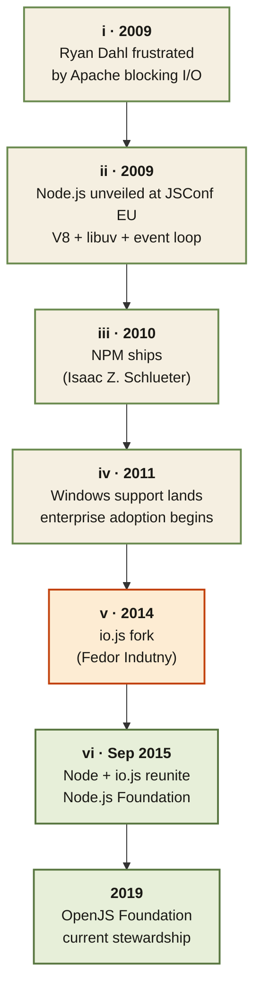

<Callout type="insight" title="One-picture recall">
  A single thirty-second glance at the Node timeline. Six hinge moments
  between 2009 and 2019 that turned a one-person frustration into the
  default backend runtime. The legend below decodes each phase.
</Callout>

## Node.js — from frustration to OpenJS

<FlowLegendGrid items={[
  { numeral: 'i',   name: 'Frustration (2009)', description: 'Apache blocks a thread per request — it breaks at 10K connections.' },
  { numeral: 'ii',  name: 'Unveil (2009)',      description: 'Ryan Dahl presents Node.js: V8 + libuv + a single-threaded event loop.' },
  { numeral: 'iii', name: 'NPM (2010)',         description: 'Isaac Z. Schlueter ships the registry that becomes the ecosystem.' },
  { numeral: 'iv',  name: 'Windows (2011)',     description: 'Official Windows support unlocks enterprise + Microsoft developer adoption.' },
  { numeral: 'v',   name: 'Fork (2014)',        description: 'io.js splits over governance + slow releases — fragmentation risk peaks.' },
  { numeral: 'vi',  name: 'Reunion (2015+)',    description: 'Merge under Node.js Foundation → OpenJS Foundation in 2019.' },
]} />
