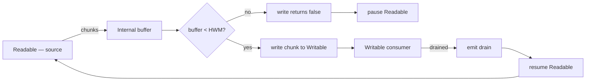

## Backpressure in a pipeline

```mermaid
flowchart LR
    A[Readable — source] -->|chunks| B[Internal buffer]
    B --> C{buffer < HWM?}
    C -->|yes| D[write chunk to Writable]
    C -->|no| E[write returns false]
    E --> F[pause Readable]
    D --> G[Writable consumer]
    G -->|drained| H[emit drain]
    H --> I[resume Readable]
    I --> A
```

`pipe` wires this loop for you — the pause / resume dance happens without explicit event
handlers in your code.
