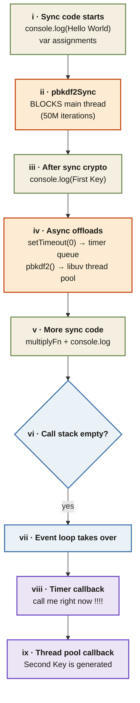

<Callout type="insight" title="One-picture recall">
  Trace the combined example step by step. V8 runs every sync line on the
  call stack, including the blocking `pbkdf2Sync` and `readFileSync`
  calls. Only once the stack is empty does libuv's timer queue and thread
  pool get to deliver their callbacks. The legend below decodes each
  phase.
</Callout>

## Sync code → call stack empty → libuv callbacks

<FlowLegendGrid items={[
  { numeral: 'i',    name: 'Sync starts',       description: 'V8 pushes GEC, prints "Hello World", assigns `a` and `b` on the call stack.' },
  { numeral: 'ii',   name: 'pbkdf2Sync blocks', description: 'Main thread frozen for seconds while V8 computes 50M iterations — event loop cannot advance.' },
  { numeral: 'iii',  name: 'Post-block sync',   description: 'Once pbkdf2Sync returns, `"First Key is Generated"` prints immediately.' },
  { numeral: 'iv',   name: 'Async offloads',    description: 'setTimeout(0) → libuv timer queue; pbkdf2() → libuv thread pool. V8 does not wait.' },
  { numeral: 'v',    name: 'More sync',         description: '`multiplyFn()` runs on the call stack, then `"Multiplication result…"` prints.' },
  { numeral: 'vi',   name: 'Stack empty',       description: 'GEC pops. V8 is idle — the call stack is finally empty.' },
  { numeral: 'vii',  name: 'Event loop',        description: 'libuv’s event loop starts pushing ready callbacks back onto the call stack.' },
  { numeral: 'viii', name: 'Timer callback',    description: 'setTimeout(0) callback fires from the timer queue — `"call me right now !!!!"`.' },
  { numeral: 'ix',   name: 'Thread pool cb',    description: 'Async pbkdf2 finishes on a worker thread; libuv delivers `"Second Key is generated"`.' },
]} />
