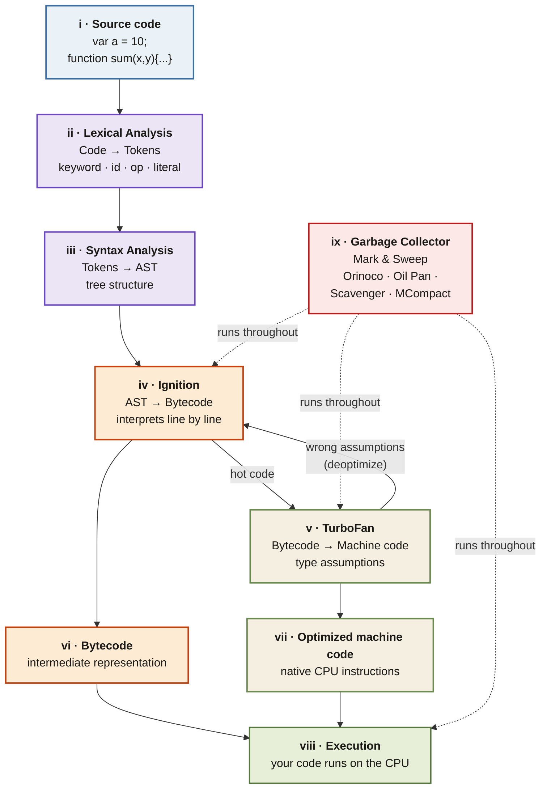

<Callout type="insight" title="One-picture recall">
  V8's full journey from source text to running code — parsing, the
  Ignition/TurboFan dance with its deoptimization back-edge, and the
  Mark-and-Sweep garbage collector running alongside everything. The
  legend below decodes each phase.
</Callout>

## V8 engine — complete internal pipeline

<FlowLegendGrid items={[
  { numeral: 'i',    name: 'Source code',       description: 'Your raw .js text enters V8 as a string of characters.' },
  { numeral: 'ii',   name: 'Lexical analysis',  description: 'V8 scans character-by-character and emits tokens: keywords, identifiers, operators, literals, punctuation.' },
  { numeral: 'iii',  name: 'Syntax analysis',   description: 'Tokens are assembled into an Abstract Syntax Tree — a hierarchical grammar structure. Invalid tokens here → SyntaxError.' },
  { numeral: 'iv',   name: 'Ignition',          description: 'V8\'s interpreter: walks the AST, emits bytecode, executes line by line for fast startup. Watches for hot functions.' },
  { numeral: 'v',    name: 'TurboFan',          description: 'Optimizing compiler: takes hot bytecode and compiles it to optimized machine code using type assumptions. Deopts back to Ignition if the assumptions break.' },
  { numeral: 'vi',   name: 'Bytecode',          description: 'Intermediate representation emitted by Ignition — lower-level than JS but not yet machine code.' },
  { numeral: 'vii',  name: 'Optimized machine code', description: 'Native CPU instructions produced by TurboFan. Runs at compiled-language speed until an assumption breaks.' },
  { numeral: 'viii', name: 'Execution',         description: 'Both bytecode and machine code funnel into the CPU — your program actually runs here.' },
  { numeral: 'ix',   name: 'Garbage collector', description: 'Mark & Sweep via Orinoco (main), Oil Pan (C++), Scavenger (young gen), MCompact (old gen) — runs concurrently throughout.' },
]} />
