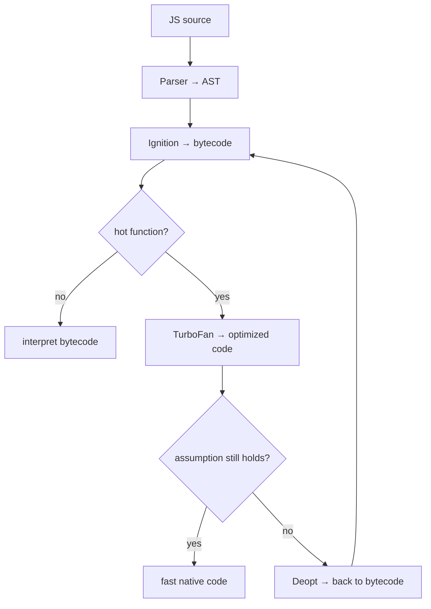

## The compile path

```mermaid
flowchart TD
    A[JS source] --> B[Parser → AST]
    B --> C[Ignition → bytecode]
    C --> D{hot function?}
    D -->|no| E[interpret bytecode]
    D -->|yes| F[TurboFan → optimized code]
    F --> G{assumption still holds?}
    G -->|yes| H[fast native code]
    G -->|no| I[Deopt → back to bytecode]
    I --> C
```

The deopt loop is the hidden tax — it's why shape-unstable code can suddenly run 10x slower.
