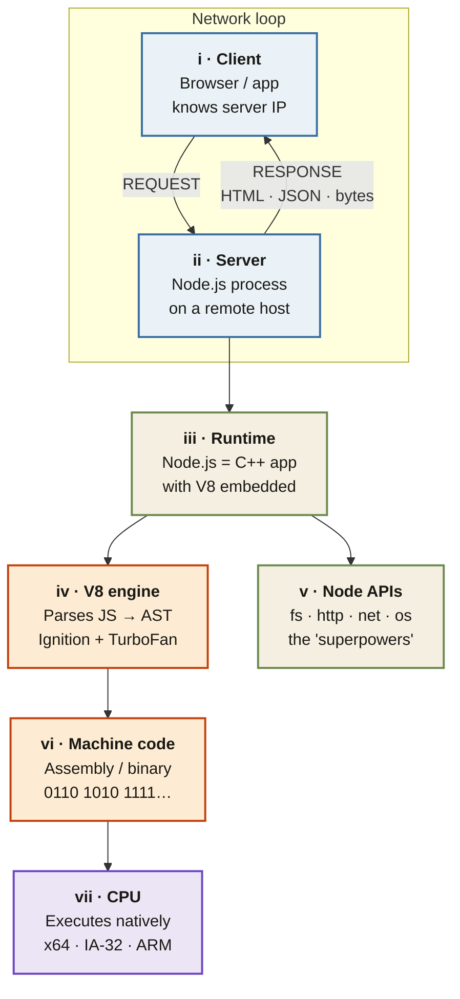

<Callout type="insight" title="One-picture recall">
  Two journeys in one frame. Left column: how a request crosses the
  network and reaches your Node process. Right column: how V8 turns the
  JavaScript inside that process into something the CPU can run. The
  legend below decodes each phase.
</Callout>

## JavaScript on the Server — from request to CPU

<FlowLegendGrid items={[
  { numeral: 'i',   name: 'Client (device)',  description: 'Browser or app. Holds the server IP and initiates the request.' },
  { numeral: 'ii',  name: 'Server',           description: 'Remote computer running a Node.js process that answers on a port.' },
  { numeral: 'iii', name: 'Node.js runtime',  description: 'C++ application with V8 embedded — provides the JS runtime the process uses.' },
  { numeral: 'iv',  name: 'V8 engine',        description: 'Parses JS into an AST, then compiles hot paths via Ignition + TurboFan.' },
  { numeral: 'v',   name: 'Node APIs',        description: 'The "superpowers" V8 lacks: fs, http, net, os, crypto, stream, child_process.' },
  { numeral: 'vi',  name: 'Machine code',     description: 'Assembly mnemonics (MOV, ADD, JMP) lowered to raw binary the CPU can execute.' },
  { numeral: 'vii', name: 'CPU',              description: 'Your processor runs the machine code natively on x64, IA-32, or ARM.' },
]} />
